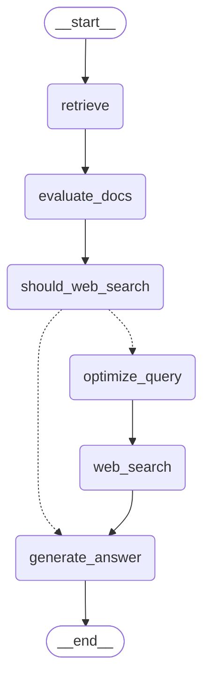

# Agentic RAG Sample

LangGraph を用いた自律型 RAG（Agentic RAG / Adaptive RAG）の実装サンプルです。

通常のRAGとは異なり、AIエージェントが「取得したドキュメントで回答可能か？」を自己評価し、情報が不足している場合は自動的に検索クエリを最適化してWeb検索（Tavily）を実行します。

## 特徴

*   **Adaptive Retrieval**: Pinecone上のベクトル検索結果をLLMが評価し、関連性が低い・不足していると判断した場合のみWeb検索を実行します。
*   **Query Optimization**: Web検索が必要な場合、元の質問を検索エンジン向けに最適なクエリにリライトします。
*   **LangGraph Implementation**: 状態管理と条件分岐（Retrieve → Evaluate → Loop/Fallback）をLangGraphで制御しています。
*   **Parallel Document Evaluation**: ドキュメント評価時に並列処理(ThreadPool)を採用し、処理速度を最大5倍高速化
*   **Dual-Source**: 社内ドキュメント（Pinecone）とWeb情報（Tavily）を統合して回答を生成します。

## 前提条件

動作には以下のAPIキーが必要です。

*   **OpenAI API Key**: 埋め込みモデル（Embeddings）およびLLM用
*   **Pinecone API Key**: ベクトルデータベース用
*   **Tavily API Key**: Web検索用

デフォルト設定では、LLM推論にOpenRouter（DeepSeekモデル）を使用するように構成されていますが、設定で変更可能です。

## インストール

### 1. リポジトリのクローン
```bash
git clone https://github.com/atsushi3hsgw/agentic_rag_sample.git
cd agentic_rag_sample
```

### 2. 依存パッケージのインストール
```bash
pip install -r requirements.txt
pip install -e .
```
※ `pip install -e .` により `agentic-rag` コマンドが使用可能になります。

## 設定

プロジェクトルートに `.env` ファイルを作成し、必要な環境変数を設定してください。
`.env.example` を参考にしてください。

```ini
# .env

# 必須APIキー
OPENAI_API_KEY=sk-...
PINECONE_API_KEY=pc-...
TAVILY_API_KEY=tvly-...

# オプション（デフォルト値が設定されています）
# LLM_MODEL=tngtech/deepseek-r1t2-chimera:free
# BASE_URL=https://openrouter.ai/api/v1
# PINECONE_INDEX_NAME=agentic-rag-index
```

## 使い方

### 1. データのインポート (Vector Store)

まず、ドキュメントデータをPineconeへロードします。
入力ファイルは **JSONL形式** で、各行に以下のフィールドを持つJSONが必要です。

```json
{"id": "doc1", "title": "ドキュメントタイトル", "paragraphs": ["本文の段落1...", "本文の段落2..."]}
```

**実行コマンド:**
```bash
python src/agentic_rag_sample/cmd/load2vector_cli.py path/to/data.jsonl
```

このコマンドは自動的にテキストをチャンク分割し、Pineconeへベクトルとして保存します。インデックスが存在しない場合は自動作成されます。

### 2. 質問の実行 (RAG Agent)

エージェントに対して質問を行います。

**コマンドラインツールとして実行:**
```bash
agentic-rag "ここに質問を入力してください"
```
または
```bash
python src/agentic_rag_sample/cmd/agentic_rag_cli.py "ここに質問を入力してください"
```

**オプション:**
*   `--verbose`: 詳細なログを出力（デフォルトで有効）。検索スコアやWeb検索の実行有無などを確認できます。
*   `--dump_graph`: 処理フロー（LangGraph）をMermaid形式で出力して終了します。

## アーキテクチャ

本システムは以下のステートマシン（Graph）で動作します。



## ディレクトリ構成

```text
.
├── .env.example                # 環境変数のサンプル
├── pyproject.toml              # プロジェクト定義
├── requirements.txt            # 依存ライブラリ
└── src/
    └── agentic_rag_sample/
        ├── cmd/
        │   ├── agentic_rag_cli.py  # RAG実行用CLI
        │   └── load2vector_cli.py  # データロード用CLI
        └── rag/
            └── agentic_rag.py      # LangGraphによるRAGロジック本体
```

## ライセンス

本プロジェクトはフリーライセンスです。自由にご利用いただけます。
